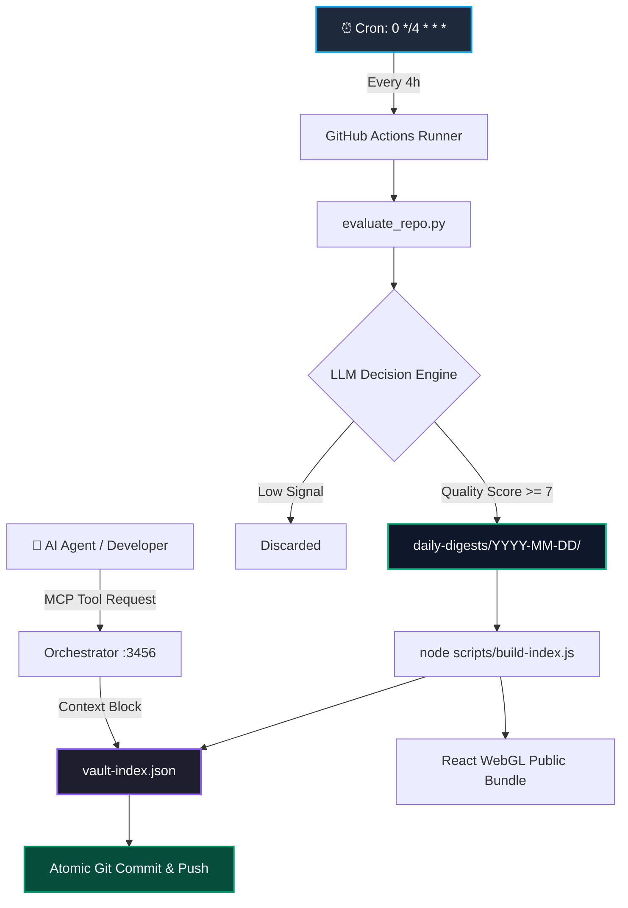

<div align="center">

# ⚡ Vybe Intelligence Vault

**The Living, Self-Reinforcing Knowledge Graph for AI Engineers & Autonomous Agent Swarms.**

*Autonomous Discovery • LLM Evaluation • Semantic Graph • MCP Context Gateway • 3D WebGL Visualization*

<br/>

[](https://github.com/sairaman436/vybe-intelligence-vault/actions)
[](#-how-it-works)
[](#-commit-budget--resilience)
[](#-intelligence-dashboard)
[](./mcp-server)
[](./LICENSE)

<br/>

[Overview](#-overview) • [How It Works](#-how-it-works) • [Architecture](#-architecture) • [MCP Integration](#-mcp-server--agent-integration) • [Learning Tracks](#-learning-paths--builder-maps) • [Quick Start](#-quick-start) • [Repository Structure](#-repository-structure)

</div>

---

## 🧭 Overview

Most AI knowledge bases go stale within weeks of creation. Static "Awesome Lists" suffer from broken links, abandoned forks, and uncurated noise.

**Vybe Intelligence Vault is a self-maintaining, autonomous knowledge graph.**

Every 4 hours, a distributed pipeline scours the AI ecosystem (GitHub, research preprints, technical disclosures, and model releases), grades them using a multi-dimensional LLM evaluator, establishes semantic graph relationships, and commits fresh intelligence directly into this repository.

### 🌟 Key Highlights
- **Zero Human Overhead**: End-to-end automated discovery, LLM scoring, and git sync.
- **Model Context Protocol (MCP)**: Native HTTP and stdio interfaces allowing Claude Desktop, Cursor, and agent swarms to query the vault dynamically.
- **Semantic 3D Graph**: Real-time WebGL interactive visualizer powered by React 19, Three.js, and vector embeddings.
- **Strict Quality Control**: Multi-tier scoring filters out low-signal boilerplate and surfaces high-momentum engineering paradigms.

---

## ⚙️ How It Works

```
                        ┌────────────────────────────────────────────────────────┐
                        │             ⏰ Scheduled Trigger (Every 4h)             │
                        └───────────────────────────┬────────────────────────────┘
                                                    │
                                                    ▼
┌────────────────────────────────────────────────────────────────────────────────────────────────────────┐
│ 1. DISCOVERY & INGESTION (Dual Engine Synergy)                                                         │
│    • Core Engine (vybe-intelligence-engine): Scrapes RSS, ArXiv, Hugging Face, Tech Blogs, PapersWithCode  │
│    • v2.0 Harvester: Discovers trending GitHub repositories, libraries, and framework releases          │
└───────────────────────────────────────────────────┬────────────────────────────────────────────────────┘
                                                    │
                                                    ▼
┌────────────────────────────────────────────────────────────────────────────────────────────────────────┐
│ 2. LLM EVALUATION & QUALITY FILTERING                                                                  │
│    • Multi-dimensional grading: Quality (1-10), RAG Relevance (1-10), Deployment Complexity, Tech Stack   │
│    • Synthesis: Generates structured Markdown digests with standardized YAML frontmatter                │
└───────────────────────────────────────────────────┬────────────────────────────────────────────────────┘
                                                    │
                                                    ▼
┌────────────────────────────────────────────────────────────────────────────────────────────────────────┐
│ 3. SEMANTIC GRAPH INDEXING                                                                             │
│    • Vector similarity pass across active intelligence nodes                                           │
│    • Computes bidirectional graph edges (similar_to, depends_on, references)                           │
│    • Generates optimized runtime index: vault-index.json                                               │
└───────────────────────────────────────────────────┬────────────────────────────────────────────────────┘
                                                    │
                                                    ▼
┌────────────────────────────────────────────────────────────────────────────────────────────────────────┐
│ 4. ATOMIC CONSOLIDATED COMMIT (Commit Rate Controlled)                                                 │
│    • Consolidates digests + graph index + statistics into 1 single atomic commit                       │
│    • Strict budget: ≤ 6 runs/day × 1 commit = Max 6 commits/day for v2.0 Harvester                     │
└───────────────────────────────────────────────────┬────────────────────────────────────────────────────┘
                                                    │
                        ┌───────────────────────────┴────────────────────────────┐
                        │                                                        │
                        ▼                                                        ▼
           ┌──────────────────────────┐                             ┌──────────────────────────┐
           │   🌐 3D WebGL Explorer   │                             │  🤖 MCP Agent Gateway    │
           │  Interactive React Graph │                             │ Dynamic Context Injector │
           └──────────────────────────┘                             └──────────────────────────┘
```

---

## 📊 Multi-Dimensional Scoring Matrix

Every candidate resource is evaluated across four core engineering dimensions before entering the vault:

| Dimension | Evaluation Criteria | Weight |
|---|---|:---:|
| **Technical Quality** | Code architecture, documentation completeness, test coverage, and API design | `35%` |
| **RAG & Agent Relevance** | Direct utility for retrieval-augmented generation, tool calling, or agent workflows | `30%` |
| **Tech Stack Alignment** | Modern stack integration (PyTorch, LangGraph, vLLM, FastMCP, Next.js, WebGL) | `20%` |
| **Community Momentum** | Real-world velocity, star momentum, active maintenance, and contributor activity | `15%` |

---

## 🤖 MCP Server & Agent Integration

The vault exposes a native **Model Context Protocol (MCP)** server, enabling seamless context injection into AI development workflows.

### 1. Claude Desktop Configuration
Add the vault MCP server to your `claude_desktop_config.json`:

```json
{
  "mcpServers": {
    "vybe-vault": {
      "command": "node",
      "args": ["/path/to/vybe-intelligence-vault/mcp-server/index.js"]
    }
  }
}
```

### 2. Cursor IDE Configuration
In `.cursorrules` or `.cursor/mcp.json`:

```json
{
  "mcpServers": {
    "vybe-intelligence-vault": {
      "command": "node",
      "args": ["scripts/orchestrator/context-injector.js"]
    }
  }
}
```

### 3. Direct HTTP Context Gateway
For custom agent frameworks (LangGraph, CrewAI, AutoGen):

```bash
# Query the context gateway
curl -X POST http://localhost:3456/inject \
  -H "Content-Type: application/json" \
  -d '{"path": "ai/agents/vostride-agent-qa.md"}'
```

---

## 🏗 Architecture & Ecosystem



### Commit Budget & Rate Limiting

To keep git history concise and prevent repository bloat, commit creation across the entire ecosystem is strictly budgeted:

- **v2.0 Harvester (`harvester.yml`)**: Every 4 hours &rarr; **Max 6 commits/day** (1 atomic commit per cycle)
- **Core Engine (`harvester-core.yml`)**: Every 4 hours staggered &rarr; **Max 6 commits/day**
- **Nightly Analytics (`vault-nightly-analytics.yml`)**: Daily at midnight &rarr; **Max 1 commit/day**
- **Total Ecosystem Volume**: **&le; 13 commits/day maximum** (well below the 15/day limit)

---

## 📚 Learning Paths & Builder Maps

The vault includes curated educational pathways and production blueprints:

### 🎓 8 Accelerated Learning Paths (7-Day Sprints)
- 🤖 **[7-Day Agent Builder](learning-paths/7-day-agent-builder.md)** — Autonomous agent loops, tool use, and multi-agent coordination.
- ⚡ **[7-Day AI Engineering](learning-paths/7-day-ai-engineering.md)** — Fine-tuning, quantization, evaluations, and structured outputs.
- 🎨 **[7-Day AI Frontend](learning-paths/7-day-ai-frontend.md)** — Streaming UI, generative components, and WebGL integration.
- 💼 **[7-Day AI SaaS Builder](learning-paths/7-day-ai-saas-builder.md)** — Production architecture, tenant isolation, and billing integration.
- 🔄 **[7-Day Automation Builder](learning-paths/7-day-automation-builder.md)** — Background workflows, cron triggers, and fault-tolerant pipelines.
- 📈 **[7-Day LLMOps](learning-paths/7-day-llmops.md)** — Observability, tracing, rate limiting, and cost optimization.
- 🔌 **[7-Day MCP Builder](learning-paths/7-day-mcp-builder.md)** — Developing, testing, and deploying custom Model Context Protocol servers.
- 🔍 **[7-Day RAG Builder](learning-paths/7-day-rag-builder.md)** — Chunking strategies, hybrid search, reranking, and vector databases.

### 🗺 6 Production Blueprints
- 🌐 [Essential 3D WebDev Blueprint](workspace-archive/best-of/essential-3d-webdev.md)
- 🤖 [Essential Agent Building Blueprint](workspace-archive/best-of/essential-agent-building.md)
- 🧠 [Essential AI Engineering Blueprint](workspace-archive/best-of/essential-ai-engineering.md)
- ⚙️ [Essential Automation Blueprint](workspace-archive/best-of/essential-automation.md)
- 💻 [Essential Frontend AI UI Blueprint](workspace-archive/best-of/essential-frontend-ai-ui.md)
- 📚 [Essential RAG Stack Blueprint](workspace-archive/best-of/essential-rag-stack.md)

---

## 🚀 Quick Start

### 1. Clone & Setup
```bash
# Clone the repository
git clone https://github.com/sairaman436/vybe-intelligence-vault.git
cd vybe-intelligence-vault

# Install dependencies
npm install
pip install -r requirements.txt
```

### 2. Run Local Smoke Tests
```bash
# Validate state manager, graph reader, and decision engine
node scripts/test-smoke.js
```

### 3. Build & Update the Semantic Graph
```bash
# Compile vault-index.json and sync React public assets
node scripts/build-index.js
```

### 4. Launch the 3D Intelligence Map
```bash
cd intelligence-map
npm install
npm run dev
```
Open [http://localhost:5173](http://localhost:5173) to explore the interactive 3D WebGL knowledge graph.

---

## 📁 Repository Structure

```
vybe-intelligence-vault/
├── .github/
│   └── workflows/
│       ├── harvester.yml           # 4-hour v2.0 discovery & atomic commit workflow
│       ├── harvester-core.yml      # 4-hour core engine sync workflow
│       └── vault-nightly-analytics.yml # Midnight health & trends digest
│
├── daily-digests/                  # Date-indexed intelligence summaries
│   └── YYYY-MM-DD/                 # Daily evaluated resources
│
├── ai/                             # Categorized knowledge nodes
│   ├── agents/                     # Agent frameworks & architectures
│   ├── rag/                        # Retrieval & vector systems
│   ├── models/                     # Foundation & open-weight models
│   └── research/                   # Breakthrough papers & preprints
│
├── learning-paths/                 # 7-day sprint roadmaps
├── maps/                           # High-level architecture maps
├── skills/                         # Guided domain checklists
├── mcp-server/                     # Native FastMCP server implementation
│
├── scripts/
│   ├── evaluate_repo.py            # Discovery & LLM evaluation engine
│   ├── build-index.js              # Graph compiler & vector edge generator
│   ├── state-manager.js            # Lock-safe atomic index reader/writer
│   └── test-smoke.js               # Pipeline verification suite
│
├── intelligence-map/               # React 19 + Three.js 3D WebGL interface
├── vault-index.json                # Master semantic graph index
└── search-index.md                 # Fast plaintext lookup table
```

---

## 🤝 Contributing & Submitting Resources

We welcome community submissions of high-quality AI tools, libraries, research, and MCP servers!

- **Submit a Resource**: Open an issue using our [Resource Suggestion Template](https://github.com/sairaman436/vybe-intelligence-vault/issues/new?template=resource-suggestion.yml).
- **Automated Ingestion**: Once approved, suggested resources are evaluated by the harvester pipeline and integrated into the graph.

---

<div align="center">

<sub>Engineered with precision by <a href="https://github.com/sairaman436">@sairaman436</a> • Self-updating continuously since 2026</sub>

</div>
