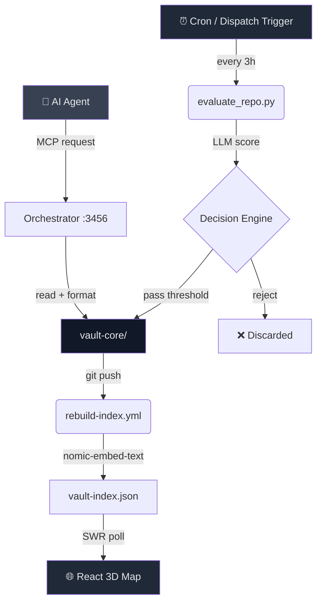

<div align="center">

[](https://github.com/sairaman436/vybe-intelligence-vault)

# `vybe-intelligence-vault`

**Automated knowledge harvesting for AI engineers.**  
Scrapes. Scores. Commits. Every 3 hours. Zero manual effort.

[](./LICENSE)
[](https://github.com/sairaman436/vybe-intelligence-vault/actions)
[](#)
[](./mcp-server)
[](#)

[Overview](#-overview) · [How It Works](#-how-it-works) · [Architecture](#-architecture) · [Quick Start](#-quick-start) · [Vault Stats](#-vault-stats) · [Contributing](#-contributing)

</div>

---

## 📌 Overview

Most AI knowledge bases go stale the moment you stop updating them. Vybe Intelligence Vault doesn't — it runs itself.

A GitHub Actions pipeline wakes up every 3 hours, discovers emerging AI/ML resources, evaluates them with an LLM scoring engine, and commits the ranked results back into the repo. No human in the loop. No manual curation.

The result: a self-reinforcing knowledge graph of **5,928 indexed resources** spanning AI agents, RAG architectures, MCP servers, and modern web tooling — always current, always queryable by local agents via an HTTP gateway.

**Built for:** AI engineers who want a living knowledge base they can plug into agentic workflows, not a static awesome-list that someone forked two years ago.

---

## ⚙️ How It Works

```
Every 3 hours:

  GitHub Actions Cron
       │
       ▼
  evaluate_repo.py          ← discovers candidate resources from configured topics
       │
       ▼
  LLM Scoring Engine        ← qwen2.5:14b (local) or cloud fallback
       │  scores: quality, rag_relevance, tech_stack match
       ▼
  vault-core/               ← ranked .md files committed back to repo
       │
       ├─▶ rebuild-index.yml  ← triggers on push
       │         │
       │         ▼
       │   nomic-embed-text   ← local Ollama embeddings
       │         │
       │         ▼
       │   vault-index.json   ← semantic node/edge graph (cosine sim > 0.75)
       │         │
       │         ▼
       │   React 3D Map       ← WebGL intelligence visualization (SWR polling)
       │
       └─▶ Orchestrator :3456 ← MCP gateway for agent context injection
```

### Scoring Pipeline

Each resource is evaluated across 4 dimensions:

| Signal | Method |
|---|---|
| Content quality | LLM pass via `qwen2.5:14b` / cloud fallback |
| RAG relevance | Keyword + semantic scoring |
| Community velocity | Stars delta, fork rate |
| Tech stack match | Tag overlap with `config.yaml` topics |

### Semantic Graph

Embeddings via `nomic-embed-text` (Ollama). Two nodes are linked if:
- Cosine similarity `> 0.75` → `similar_to`
- Shared tech stack → `depends_on`  
- Same category + shared tags → `references`

Edge weight = `cosine_sim + (shared_tags × 0.08)`

### MCP Gateway

HTTP bridge on `:3456`. Send a vault file path → receive a clean, LLM-formatted context block. Agents can pull any resource into their context window without reading the filesystem directly.

```bash
# Example agent request
curl -X POST http://localhost:3456/inject \
  -d '{"path": "ai/agents/tool-use-patterns.md"}'
```

---

## 🏗 Architecture



### Key Design Decisions

**Write-lock state management** — `state.lock` prevents collision writes when multiple pipeline jobs run concurrently. All mutations are append-only to `vault-events.log` (JSONL). In-memory reads use a 30s TTL. → [`scripts/state-manager.js`](./scripts/state-manager.js)

**Hybrid inference** — Pipeline tries local Ollama first (zero cost, no rate limits). Falls back to cloud LLM if Ollama is unavailable. Scoring is deterministic via fixed seed. → [`scripts/evaluate_repo.py`](./scripts/evaluate_repo.py)

**Bot commits on heatmap** — Git identity configured so automated commits register on the contribution graph. Pipeline runs as `vybe-bot` with a PAT scoped to `repo` only. → [`.github/workflows/harvester.yml`](./.github/workflows/harvester.yml)

---

## 🚀 Quick Start

### Prerequisites

- [Ollama](https://ollama.com) installed and running
- Node.js 18+
- Python 3.10+

### Setup

```bash
# Clone
git clone https://github.com/sairaman436/vybe-intelligence-vault.git
cd vybe-intelligence-vault

# Pull required models
ollama pull nomic-embed-text   # embeddings
ollama pull qwen2.5:14b        # scoring

# Install dependencies
npm install
pip install -r requirements.txt

# Start everything (MCP server + orchestrator + web UI)
bash scripts/vault-init.sh
```

### Verify

```bash
# Check service health, ports, and event log
bash scripts/vault-status.sh
```

Open `http://localhost:3000` for the 3D intelligence map.

### Configure Topics

Edit `vault-core/config.yaml` to control what gets harvested:

```yaml
topics:
  - ai-agents
  - rag-architectures
  - mcp-servers
  - llm-inference
  - next-gen-web

token_budget: 4096
score_threshold: 0.65
```

---

<!-- VAULT_STATS:START -->

<div align="center">
  <h2>📊 Intelligence Analytics Dashboard</h2>
  <p><em>Real-time metrics generated from active vault contents.</em></p>
  
  <table>
    <tr>
      <td align="center">
        <h3>🗄️ Core Storage</h3>
        <p><b>Resources tracked:</b> 12,734</p>
        <p><b>Active:</b> 12,441 | <b>Inactive:</b> 293</p>
      </td>
      <td align="center">
        <h3>📂 Archives & Maps</h3>
        <p><b>Archive Files:</b> 50,206</p>
        <p><b>Builder Maps:</b> 8</p>
      </td>
      <td align="center">
        <h3>⚡ Status</h3>
        <p><b>Total Vault Size:</b> 62,940 files</p>
        <p><b>Last Update:</b> 2026-07-18 01:35 IST</p>
        <p><b>Health:</b> 🟢 Optimal</p>
      </td>
    </tr>
  </table>
</div>

<br/>

### 📈 Trending Signals
> Top rising resources based on momentum and community velocity.

- 🔼 **[EEG shows brain can simultaneous encode two speech streams](ai/community/eeg-shows-brain-can-simultaneous-encode-two-speech.md)** • <kbd>+170 pts</kbd> • Rank: <kbd>+3</kbd>
- 🔼 **[Legal - Apple Privacy Policy - Apple](ai/rag/legal-apple-privacy-policy-apple.md)** • Rank: <kbd>+44</kbd>
- 🔼 **[Official Apple Support Community](ai/rag/official-apple-support-community.md)** • Rank: <kbd>+6053</kbd>
- 🔼 **[Apple Vision Pro - Apple](ai/resources/apple-vision-pro-apple.md)** • Rank: <kbd>+6023</kbd>
- 🔼 **[SpeechifyInc/ai-api-examples](ai/resources/speechifyinc-ai-api-examples.md)** • Rank: <kbd>+36</kbd>

### 🌟 New Discoveries
> Fresh intelligence recently indexed into the vault.

- 🆕 **[Apple targets dozens of OpenAI employees with legal letters](ai/community/apple-targets-dozens-of-openai-employees-with-lega.md)** • Score: `305`
- 🆕 **[Mozilla: The state of open source AI](ai/community/mozilla-the-state-of-open-source-ai.md)** • Score: `275`
- 🆕 **[AI Meets Cryptography 2: What AI Found in OpenVM's ZkVM](ai/community/ai-meets-cryptography-2-what-ai-found-in-openvm-s.md)** • Score: `60`
- 🆕 **[VulnHunter: Capital One's agentic AI code security tool](ai/community/vulnhunter-capital-one-s-agentic-ai-code-security.md)** • Score: `46`
- 🆕 **[Legal - Website Terms of Use - Apple](ai/agents/legal-website-terms-of-use-apple.md)** • Score: `0`

### 💤 Recently Inactive
> Resources showing declined activity or relevance.

- 💤 **[$100 AI Music Video: Claude Fable 5 vs. GPT-5.6 Sol](ai/community/100-ai-music-video-claude-fable-5-vs-gpt-5-6-sol.md)**
- 💤 **[LM Studio Bionic: the AI agent for open models](ai/community/lm-studio-bionic-the-ai-agent-for-open-models.md)**
- 💤 **[The LLM Critics Are Right. I Use LLMs Anyway](ai/community/the-llm-critics-are-right-i-use-llms-anyway.md)**
- 💤 **[Detecting LLM-Generated Texts with “Classical” Machine Learning](ai/community/detecting-llm-generated-texts-with-classical-machi.md)**
- 💤 **[How to Train a Gen AI Kick Drum Model on Your Old Linux Desktop with 6GB VRAM](ai/community/how-to-train-a-gen-ai-kick-drum-model-on-your-old.md)**

The stats shown here are generated from the current vault content. They refresh automatically when the bot finds changes.

<!-- Automated Stats Injection Block -->

<!-- VAULT_STATS:END -->

---

## 📁 Repository Layout

```
vybe-intelligence-vault/
├── .github/
│   └── workflows/
│       ├── harvester.yml        # Main 1h cron pipeline
│       └── rebuild-index.yml    # Triggered on vault-core/ push
│
├── vault-core/
│   ├── config.yaml              # Topics, token budgets, score thresholds
│   ├── vault-index.json         # Compiled semantic node/edge graph
│   └── vault-events.log         # Append-only JSONL event ledger
│
├── intelligence-map/            # React 19 + WebGL 3D dashboard
│
├── mcp-server/                  # FastMCP integration server
│
├── scripts/
│   ├── evaluate_repo.py         # Resource discovery + LLM scoring
│   ├── orchestrator/
│   │   └── context-injector.js  # MCP context formatter
│   ├── state-manager.js         # Lock-safe state writes
│   ├── build-index.js           # Embedding + edge compiler
│   ├── vault-init.sh            # Startup daemon (concurrent)
│   └── vault-status.sh          # Port + health diagnostics
│
├── ai/                          # Indexed resources by category
│   ├── agents/
│   ├── rag/
│   ├── models/
│   └── mcp/
│
└── search-index.md              # Flat searchable index
```

---

## 🗺 Roadmap

- [ ] Vector search API over `vault-index.json` (FastAPI endpoint)
- [ ] Discord/Slack bot that answers "what's new in RAG this week?"
- [ ] Contributor scoring — track who surfaces the highest-value resources
- [ ] Export to Obsidian vault format
- [ ] GitHub App so others can run their own vault instance

---

## 🤝 Contributing

PRs welcome. Read [CONTRIBUTING.md](./CONTRIBUTING.md) first.

```bash
# Run the scoring pipeline locally against a single URL
python scripts/evaluate_repo.py --url https://github.com/your/repo --dry-run
```

Bug reports → [open an issue](https://github.com/sairaman436/vybe-intelligence-vault/issues)  
MIT License — see [LICENSE](./LICENSE)

---

<div align="center">
<sub>Built by <a href="https://github.com/sairaman436">@sairaman436</a> · Auto-updating since 2026</sub>
</div>
