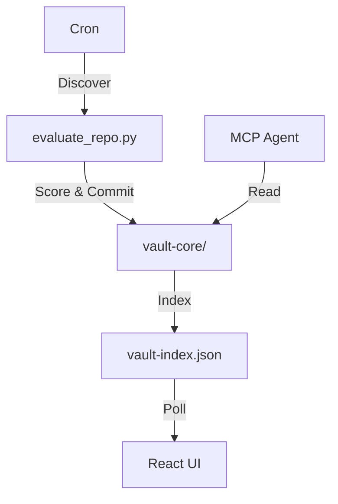

<p align="center">
  
</p>

Automated knowledge harvesting for AI engineers.
Self-updating. LLM-scored. Agent-ready.

[](LICENSE)
[](.github/workflows/rebuild-index.yml)
[](.github/workflows/harvester.yml)
[](mcp-server/)

## What It Does

- Scrapes and scores AI/ML resources on a 3-hour GitHub Actions cron
- Builds a vector-indexed knowledge graph with semantic edges (cosine sim > 0.75)
- Exposes an MCP-compatible context injection gateway on port 3456
- Tracks trending signals, scores resources via local Ollama + cloud LLM fallback

## Architecture



- **State Management**: Handled by `scripts/state-manager.js`
- **Embeddings**: Semantic edges calculated in `scripts/build-index.js`
- **Gateway**: Local agent context injection routed through `scripts/orchestrator/context-injector.js`

## Analytics

<!-- VAULT_STATS:START -->
| Metric | Value |
|--------|-------|
| Resources Tracked | 6,628 |
| Last Update | 2026-06-25 |
| Health | 🟢 Optimal |
<!-- VAULT_STATS:END -->

Trending signals update on each pipeline run.

## Execution Control

Initialize the local orchestrator and required LLM models.
```bash
# 1. Start Ollama and download models
ollama pull nomic-embed-text
ollama pull qwen2.5:14b

# 2. Run system init (concurrently runs MCP, Orchestrator, & Web UI)
bash scripts/vault-init.sh
```

Check system health, port status, and pipeline events.
```bash
bash scripts/vault-status.sh
```

## Repository Layout

```txt
.
├── vault-core/
│   ├── config.yaml          # Search topics and token budget limits
│   ├── vault-index.json     # Compiled relation graph (nodes and edges)
│   └── vault-events.log     # Event sourced pipeline ledger
├── intelligence-map/        # React 19 3D visual WebGL dashboard
├── mcp-server/              # FastMCP integration server
├── scripts/
│   ├── orchestrator/        # Context window optimization engines
│   ├── state-manager.js     # Lock-safe state management module
│   ├── build-index.js       # Index compiler and embedding calculator
│   ├── vault-init.sh        # Startup orchestrator daemon
│   └── vault-status.sh      # Service health status query script
└── search-index.md
```

## Contributing

PRs welcome — see CONTRIBUTING.md. MIT licensed.
