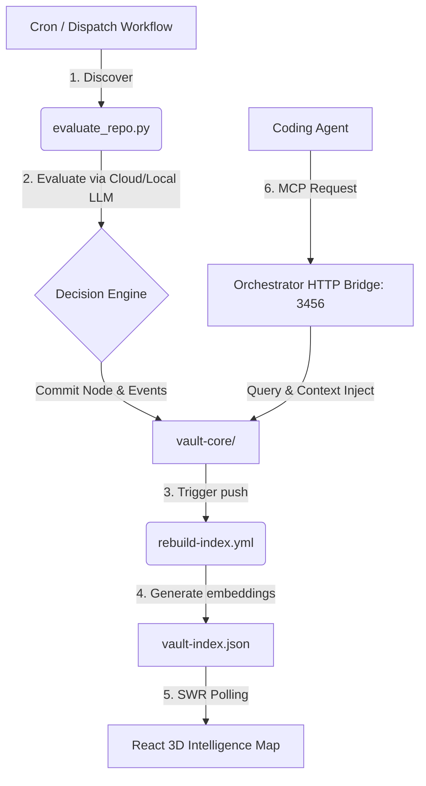

<p align="center">
  
</p>

<div align="center">

# Vybe Intelligence Vault

An auto-updating open-source intelligence vault for AI agents, RAG systems, MCP servers, prompts, tools, templates, and next-generation web development.

[]()
[]()
[]()
[]()
[]()
[]()

</div>

<p align="center">
  <a href="#why-this-vault-is-different">Why Different</a> ·
  <a href="#vault-stats">Stats</a> ·
  <a href="#explore-the-vault">Explore</a> ·
  <a href="#living-skill-files">Living Skills</a> ·
  <a href="#start-building">Start Building</a> ·
  <a href="#how-updates-work">Updates</a>
</p>

---

## Intro

The AI Internet moves fast. New agents, tools, repositories, prompts, research papers, templates, workflows, and frameworks appear every day.

Vybe Intelligence Vault tracks the signal and organizes it into a clean, builder-friendly archive.

Vybe Intelligence Vault is not a static dump. It is a live AI builder intelligence vault that tracks public AI and web-development signals and organizes them into maps, learning paths, build ideas, skill files, indexes, and archive sections.

---

<!-- VAULT_STATS:START -->

## Vault Stats

| Metric | Count |
|---|---:|
| Resources tracked | 5927 |
| Active resources | 5784 |
| Inactive resources | 143 |
| Archive files | 24571 |
| Archive categories | 35 |
| Builder maps | 8 |
| Learning paths | 8 |
| Build ideas | 8 |
| Best-of guides | 6 |
| Last meaningful update | 2026-06-22 15:59 IST |

### Trend Intelligence Dashboard

#### Trending Resources
- **[Danish privacy activist Lars Andersen raided by police](ai/community/danish-privacy-activist-lars-andersen-raided-by-po.md)** (Rank: +2) (+195 points)
- **[Apertus – Open Foundation Model for Sovereign AI](ai/community/apertus-open-foundation-model-for-sovereign-ai.md)** (+82 points)
- **[Good results fine tuning a local LLM like Qwen 3:0.6B to categorize questions](ai/community/good-results-fine-tuning-a-local-llm-like-qwen-3-0.md)** (+51 points)
- **[JSON-LD explained for personal websites](ai/community/json-ld-explained-for-personal-websites.md)** (+28 points)
- **[PEP 0 – Index of Python Enhancement Proposals (PEPs) | peps.python.org](ai/rag/pep-0-index-of-python-enhancement-proposals-peps-p.md)** (Rank: +125)

#### New Discoveries
- **[Munich 1991: The Roots of the Current AI Boom](ai/community/munich-1991-the-roots-of-the-current-ai-boom.md)** (Score: 53)
- **[Customer Support](ai/resources/customer-support.md)** (Score: 0)
- **[How to Apply for a Federal Funding Opportunity on Grants.gov – Grants.gov Community Blog](ai/resources/how-to-apply-for-a-federal-funding-opportunity-on.md)** (Score: 0)
- **[Tanium Titans Community](ai/resources/tanium-titans-community.md)** (Score: 0)
- **[Solodit](ai/resources/solodit.md)** (Score: 0)

#### Recently Inactive Resources
- **[chopratejas/headroom](ai/rag/chopratejas-headroom.md)**

The stats shown here are generated from the current vault content. They refresh automatically when the bot finds changes.

<!-- VAULT_STATS:END -->

---

## Why This Vault Is Different

| Typical archive      | Vybe Intelligence Vault                                           |
| -------------------- | ----------------------------------------------------------------- |
| Static list of links | Auto-updated every 3 hours                                        |
| Tool dump            | Builder-focused intelligence system                               |
| Hard to navigate     | Maps, best-of guides, search index, learning paths                |
| Popular repos only   | Also tracks early-stage relevant repos, including zero-star repos |
| Manual updates       | Scheduled automation through GitHub Actions                       |
| Random resources     | Scored, categorized, safety-scanned resources                     |
| Only AI tools        | AI, agents, RAG, MCP, prompts, webdev, automation, startup ideas  |

---

## Explore the Vault

| Section                                 | What it gives you                                    |
| --------------------------------------- | ---------------------------------------------------- |
| [Search Index](search-index.md)         | Searchable map of vault resources                    |
| [Intelligence](intelligence/)           | Latest AI signals, trends, research, repos           |
| [Workspace Archive](workspace-archive/) | Categorized AI and web development archive           |
| [Builder Maps](maps/)                   | Stack maps for agents, RAG, MCP, LLMOps, frontend AI |
| [Build Ideas](build-ideas/)             | Practical project ideas for portfolio and products   |
| [Learning Paths](learning-paths/)       | 7-day learning paths for key skills                  |
| [Examples](examples/)                   | How to use this vault with coding agents             |
| [Stats](stats/)                         | Public vault stats and category counts               |
| [Roadmap](ROADMAP.md)                   | Planned improvements and future direction            |
| [Changelog](CHANGELOG.md)               | Latest meaningful vault updates                      |

---

## What Is Inside

| Area                    | Includes                                        |
| ----------------------- | ----------------------------------------------- |
| AI Agents               | Agent frameworks, orchestration, tool use       |
| RAG Systems             | Retrieval apps, templates, chunking, reranking  |
| MCP Servers             | Servers, tools, examples, security notes        |
| Prompt Libraries        | System prompts, coding prompts, agent prompts   |
| AI Coding Agents        | Codex, Cursor, Windsurf, Claude Code, Cline     |
| LLM App Templates       | FastAPI, Next.js, chat apps, AI SaaS templates  |
| Evals and Observability | RAGAS, promptfoo, Langfuse, tracing, monitoring |
| Frontend AI UI          | Chat UI, dashboards, shadcn, Tailwind layouts   |
| 3D Creative Web         | Three.js, R3F, WebGPU, shaders, Spline          |
| Startup Builder         | MVP ideas, SaaS resources, launch patterns      |

---

## Living Skill Files

The vault does not only save links. It continuously updates skill guides based on recent public GitHub repositories, tools, frameworks, docs, templates, and other useful public resources.

Stars and forks are bonus signals, not gatekeeping filters. A zero-star repository can still be included if it is fresh, relevant, and useful for builders.

| Skill            | Updated signals                                  |
| ---------------- | ------------------------------------------------ |
| AI Agents        | Frameworks, orchestration patterns, agent repos  |
| RAG              | Templates, vector databases, chunking, reranking |
| MCP              | Servers, tools, integrations, examples           |
| LLMOps           | Evals, tracing, monitoring, RAG evaluation       |
| AI Coding Agents | Codex, Cursor, Windsurf, Claude Code, Cline      |
| Frontend AI UI   | Chat UI, dashboards, AI interfaces               |
| 3D Web           | Three.js, React Three Fiber, WebGPU, shaders     |
| Automation       | n8n, Playwright, browser workflows               |

---

## Start Building

| Start Here               | Path                                                                                                           |
| ------------------------ | -------------------------------------------------------------------------------------------------------------- |
| Essential AI Engineering | [workspace-archive/best-of/essential-ai-engineering.md](workspace-archive/best-of/essential-ai-engineering.md) |
| Essential Agent Building | [workspace-archive/best-of/essential-agent-building.md](workspace-archive/best-of/essential-agent-building.md) |
| Essential RAG Stack      | [workspace-archive/best-of/essential-rag-stack.md](workspace-archive/best-of/essential-rag-stack.md)           |
| Essential Frontend AI UI | [workspace-archive/best-of/essential-frontend-ai-ui.md](workspace-archive/best-of/essential-frontend-ai-ui.md) |
| Essential 3D Web Dev     | [workspace-archive/best-of/essential-3d-webdev.md](workspace-archive/best-of/essential-3d-webdev.md)           |
| Essential Automation     | [workspace-archive/best-of/essential-automation.md](workspace-archive/best-of/essential-automation.md)         |
| Newest Resources         | [workspace-archive/_navigation/newest.md](workspace-archive/_navigation/newest.md)                             |
| Skill Index              | [_index/skill-index.md](_index/skill-index.md)                                                                 |

---

## Use With AI Coding Agents

Vault 2.0 features a native Model Context Protocol (MCP) server and HTTP Orchestrator bridge, allowing AI coding agents (such as Codex, Cursor, Windsurf, Claude Code, Cline, and Aider) to query, search, and inject vault files directly into their context window.

Example prompt:
```txt
Use this vault to find the best RAG project ideas and create a 7-day build plan.
```

---

## 🏗️ Vault 2.0 Architecture

Vybe Vault 2.0 establishes a fully self-reinforcing knowledge loop between the automated pipeline, your local LLMs, and a 3D interface:



### 1. The Single Source of Truth (`vault-core/`)
- `vault-index.json`: Compiled graph mapping containing v2.0 metadata nodes, edges calculated from cosine vector similarities, and system health metrics.
- `vault-events.log`: Append-only event-sourced JSONL stream tracking discovery, valuations, and agent reads.
- `embeddings/`: Gitignored cache storing 768-dimension nomic-embed-text vector files for each node.

### 2. HTTP Orchestration Bridge & Decision Engine
Runs as a lightweight, Express-free Node service on port `3456`:
- `/orchestrate`: Handles pipeline commands (`harvest`, `rebuild`), filters (`query`), and prompt injections (`inject`).
- `/events`: Accesses the tail of the events log.
- `/health`: Health status checks of local ports.
- **Decision Engine**: Automatically tracks daily API cost budgets and routes query evaluations to local Ollama (qwen2.5:14b) or cloud LLMs (gpt-4o-mini).

### 3. Interactive 3D Web Dashboard (`intelligence-map/`)
- **Visuals**: React 19 + Vite dashboard running on port `5173`, styled with 90s CRT vignettes and scanlines.
- **3D Physics Layout**: Computes real-time layouts using `d3-force-3d` with collision physics.
- **Geometries**: Icosahedron (skills), Box (maps), and Octahedron (daily-digests) category structures.
- **Shader Edges**: Glowing Cylinder meshes running custom fragment shaders representing data-flow paths.
- **Features**: SWR polling hooks, Framer Motion Cmd+K fuzzy-search search chip modal, and GSAP scroll trajectories.

### 4. Unified Harvester Pipeline
A multi-stage GitHub Actions runner executing every 3 hours:
- **DISCOVER**: Searches GitHub API for configuring topics and saves `discovery-batch.json`.
- **EVALUATE**: Fetches readme content, calls cloud or local Ollama routines, and writes `evaluated-batch.json`.
- **COMMIT**: Commits new daily-digests markdown entries and appends cost tracking correlation IDs.
- **REBUILD**: Wait for the rebuild-index workflow, recalculates averages, and publishes `pipeline-report.json`.

---

## ⚡ Quick Start: Local Orchestration

To run the entire Vault 2.0 system locally:

```bash
# 1. Start Ollama (Ensure nomic-embed-text is pulled)
ollama pull nomic-embed-text
ollama pull qwen2.5:14b

# 2. Run the start helper from the repository root
bash scripts/vault-init.sh
```

This starts all three services concurrently in your terminal:
- **MCP Server** (FastMCP) at `http://localhost:3000`
- **Orchestrator Bridge** (Agent Command gateway) at `http://localhost:3456`
- **Intelligence Map Web App** (CRT 3D dashboard) at `http://localhost:5173`

To audit the current health of the vault, run:
```bash
bash scripts/vault-status.sh
```

---

## 📂 Repository Structure

```txt
.
├── vault-core/
│   ├── config.yaml          # Topic list and token budget config
│   ├── vault-index.json     # Node/edge graph metadata
│   └── vault-events.log     # Event sourced audit stream
├── intelligence-map/        # React 19 3D Web GL Dashboard
├── mcp-server/              # Native python FastMCP server
├── scripts/
│   ├── orchestrator/        # Context injection and routing engines
│   ├── state-manager.js     # Thread-safe read/write locking module
│   ├── build-index.js       # Index parser and vector edge generator
│   ├── vault-init.sh        # Service startup helper
│   └── vault-status.sh      # Service health status query script
├── maps/                    # Stack blueprints (Cyan nodes)
├── skills/                  # Living guides (Amber nodes)
├── daily-digests/           # Discovered repo reviews (Magenta nodes)
├── prompts/                 # Prompt templates (Green nodes)
└── search-index.md
```

---

## How Updates Work

This vault is refreshed every 3 hours by a private harvester bot running through GitHub Actions configured to the canonical **Asia/Kolkata (IST)** timezone (`+05:30`).

Each run:
- queries GitHub and filters already indexed entries in `vault-index.json`
- evaluates readme files using cloud models or local fallback routers
- commits daily digests and logs token costs in the event log
- rebuilds similarity coordinates and publishes reports

If no meaningful changes are found, the workflow exits successfully without creating empty commits.
For details on timezone mapping and bot attribution verification, see the [Timezone Audit Report](timezone_audit_report.md).

---

## Contributing

Found a useful AI repo, prompt library, MCP server, RAG template, dataset, API, or web-development resource?

Open an issue or pull request.

See [CONTRIBUTING.md](CONTRIBUTING.md) for guidelines.

---

## Attribution and Disclaimer

This vault contains curated metadata, summaries, links, and notes from public resources. Original content belongs to respective authors. Source URLs are preserved wherever available.

This repository does not claim ownership of external resources.

---

## License

This project is released under the MIT License where applicable. See [LICENSE](LICENSE).

---

## Support the Vault

If this vault helps you discover useful AI resources, consider starring the repo so more builders can find it.
