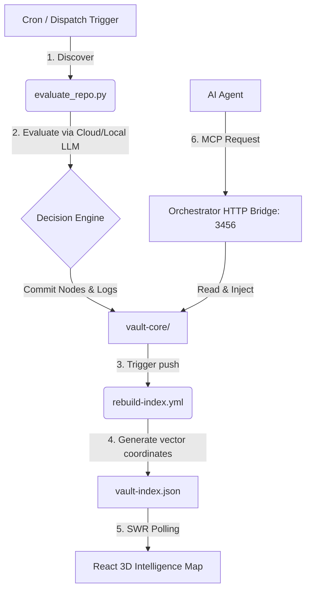

<p align="center">
  
</p>

<div align="center">

# Vybe Intelligence Vault

An automated, self-reinforcing knowledge repository for AI Engineering, Agentic Workflows, Model Context Protocol (MCP) integrations, RAG architectures, and modern web application development.

[]()
[]()
[]()
[]()

</div>


## ── Dossier Overview

The velocity of the AI landscape is unprecedented. Curation of tools, retrieval paradigms, agent protocols, and template architectures requires active synthesis. Vybe Intelligence Vault processes emerging public signals, scoring and indexing repositories using local and cloud LLM evaluations.

---

<!-- VAULT_STATS:START -->

<div align="center">
  <h2>📊 Intelligence Analytics Dashboard</h2>
  <p><em>Real-time metrics generated from active vault contents.</em></p>
  
  <table>
    <tr>
      <td align="center">
        <h3>🗄️ Core Storage</h3>
        <p><b>Resources tracked:</b> 12,575</p>
        <p><b>Active:</b> 12,232 | <b>Inactive:</b> 343</p>
      </td>
      <td align="center">
        <h3>📂 Archives & Maps</h3>
        <p><b>Archive Files:</b> 47,982</p>
        <p><b>Builder Maps:</b> 8</p>
      </td>
      <td align="center">
        <h3>⚡ Status</h3>
        <p><b>Last Update:</b> 2026-07-03 22:55 IST</p>
        <p><b>Health:</b> 🟢 Optimal</p>
      </td>
    </tr>
  </table>
</div>

<br/>

### 📈 Trending Signals
> Top rising resources based on momentum and community velocity.

- 🔼 **[Reality has a surprising amount of detail (2017)](ai/community/reality-has-a-surprising-amount-of-detail.md)** • <kbd>+23 pts</kbd>
- 🔼 **[Discourse | Where Tech Companies Build Communities](ai/resources/discourse-where-tech-companies-build-communities.md)** • Rank: <kbd>+1697</kbd>
- 🔼 **[github/codeql](ai/resources/github-codeql.md)** • Rank: <kbd>+6</kbd>
- 🔼 **[npm Status](ai/rag/npm-status.md)** • Rank: <kbd>+8</kbd>
- 🔼 **[Getting Started | Electron Forge](ai/rag/getting-started-electron-forge.md)** • Rank: <kbd>+8</kbd>

### 🌟 New Discoveries
> Fresh intelligence recently indexed into the vault.

- 🆕 **[Jamesob's guide to running SOTA LLMs locally](ai/community/jamesob-local-llm.md)** • Score: `38`
- 🆕 **[My Dad Helped Build North America's Oat Supply Chain: Can It Be Remade?](ai/community/my-dad-helped-build-north-america-s-oat-supply-cha.md)** • Score: `14`
- 🆕 **[Speechify Inc status](ai/resources/speechify-inc-status.md)** • Score: `0`
- 🆕 **[Submit a Report - Watchdog](ai/rag/submit-a-report-watchdog.md)** • Score: `0`
- 🆕 **[istio/community](ai/resources/istio-community.md)** • Score: `0`

### 💤 Recently Inactive
> Resources showing declined activity or relevance.

- 💤 **[The short leash AI coding method for beating Fable](ai/community/the-short-leash-ai-coding-method-for-beating-fable.md)**
- 💤 **[Please stop the AI confidence theater](ai/community/please-stop-the-ai-confidence-theater.md)**

The stats shown here are generated from the current vault content. They refresh automatically when the bot finds changes.

<!-- Automated Stats Injection Block -->

<!-- VAULT_STATS:END -->

---

## ── Core Architecture (Vault 2.0)

Vybe Vault 2.0 establishes a closed-loop system syncing automated harvesting, local vector inference, and visual analytics:



### 1. State Management & Event Sourcing
State write-locks (`state.lock`) prevent collision writes. Updates append to `vault-events.log` (JSONL format) while reads leverage a 30s TTL in memory.

*Commented node index updates:*
```javascript
// scripts/state-manager.js
async function updateNode(id, mutations) {
  // Acquire lock using 'wx' flag on state.lock file to prevent collisions
  await acquireLock();
  try {
    const index = readIndex();
    let node = index.nodes.find(n => n.id === id);
    const nowStr = new Date().toISOString();
    
    if (node) {
      // Merge node properties and update modified timestamp
      Object.assign(node, mutations);
      node.last_modified = nowStr;
    } else {
      // Initialize node using the version 2.0 schema structure
      node = {
        id,
        path: mutations.path || id,
        title: mutations.title || path.basename(id, '.md'),
        category: mutations.category || 'skills',
        tags: mutations.tags || [],
        tech_stack: mutations.tech_stack || [],
        quality_score: mutations.quality_score || 0,
        rag_relevance: mutations.rag_relevance || 0,
        embedding_vector_id: mutations.embedding_vector_id || '',
        last_modified: nowStr,
        access_count: 0,
        last_accessed: ''
      };
      index.nodes.push(node);
    }
    
    // Write out updated index to source of truth and root copy
    writeIndex(index);
    return node;
  } finally {
    // Gracefully release lock file
    releaseLock();
  }
}
```

### 2. Embeddings & Relation Edges
Runs cosine similarity (`sim > 0.75`) using local Ollama (`nomic-embed-text`) to establish semantic edges, combining tag overlap and parsed relative markdown links.

*Commented similarity edge evaluations:*
```javascript
// scripts/build-index.js
// Calculate similarity and tags to dynamically draw edges
const sim = cosineSimilarity(vector1, vector2);
const sharedTags = tags2.filter(t => tags1.has(t));

if (sim > 0.75 || sharedTags.length >= 1) {
  // Select type based on tech stack or category overlaps
  let type = 'similar_to';
  if (sharedTech.length >= 1) type = 'depends_on';
  else if (n1.category === n2.category) type = 'references';
  
  edges.push({
    source: n1.path,
    target: n2.path,
    type,
    weight: parseFloat((sim + sharedTags.length * 0.08).toFixed(2))
  });
}
```

### 3. Agentic Command gateway
Runs concurrently on port `3456` enabling local agents to inject clean prompt contexts dynamically:

*Commented injection formatter:*
```javascript
// scripts/orchestrator/context-injector.js
function injectFile(filePath) {
  const fullPath = path.resolve(ROOT_DIR, filePath);
  
  // Enforce directory boundaries
  if (!fullPath.startsWith(ROOT_DIR)) {
    throw new Error('Access denied: Out of bounds path');
  }
  
  const content = fs.readFileSync(fullPath, 'utf-8');
  
  // Formats file cleanly for the LLM context window
  let header = `=== VAULT ENTRY: ${filePath} ===\n`;
  header += `================================================\n\n`;
  
  return `${header}${content}\n\n=== END VAULT ENTRY ===`;
}
```

---

## ⚡ Execution Control

Launch local orchestration using the concurrent init script:

```bash
# 1. Start Ollama and download models
ollama pull nomic-embed-text
ollama pull qwen2.5:14b

# 2. Run system init (concurrently runs MCP, Orchestrator, & Web UI)
bash scripts/vault-init.sh
```

Audit system ports, events, and health metrics:
```bash
bash scripts/vault-status.sh
```

---

## 📁 Repository Layout

```txt
.
├── vault-core/
│   ├── config.yaml          # Search topics and token budget limits
│   ├── vault-index.json     # Compiled relation graph (nodes and edges)
│   └── vault-events.log     # Event sourced pipeline ledger
├── intelligence-map/        # React 19 3D visual WebGL dashboard
├── mcp-server/              # FastMCP integration server
├── scripts/
│   ├── orchestrator/        # Context window optimization engines
│   ├── state-manager.js     # Lock-safe state management module
│   ├── build-index.js       # Index compiler and embedding calculator
│   ├── vault-init.sh        # Startup orchestrator daemon
│   └── vault-status.sh      # Service health status query script
└── search-index.md
```

---

## 🤝 Contributing & License

- Submit issues or pull requests conforming to guidelines in [CONTRIBUTING.md](CONTRIBUTING.md).
- Code is released under the **MIT License**. Details available in [LICENSE](LICENSE).
