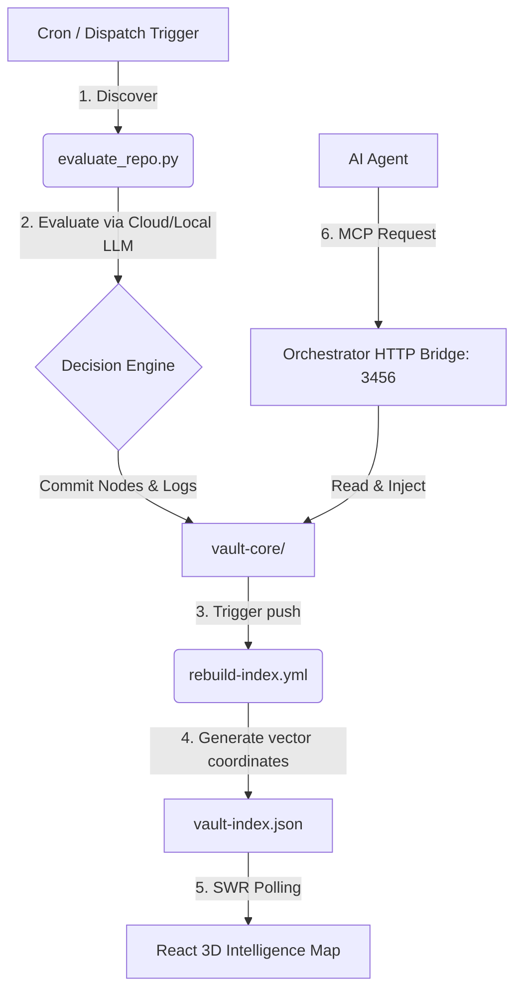

<p align="center">
  
</p>

<div align="center">

# Vybe Intelligence Vault

An automated, self-reinforcing knowledge repository for AI Engineering, Agentic Workflows, Model Context Protocol (MCP) integrations, RAG architectures, and modern web application development.

[]()
[]()
[]()
[]()

</div>

---

## 🌟 Overview

The velocity of the AI landscape is unprecedented. Navigating the daily influx of new agent frameworks, retrieval paradigms, tool protocols, templates, and research demands structured synthesis rather than static logs.

**Vybe Intelligence Vault** bridges this gap. It operates as an active, self-indexing repository that continuously harvests emerging public signals, evaluates repositories using cloud and local LLMs, and maps cognitive relationships into an interactive 3D WebGL dashboard.

---

<!-- VAULT_STATS:START -->

## Vault Stats

| Metric | Count |
|---|---:|
| Resources tracked | 5927 |
| Active resources | 5784 |
| Inactive resources | 143 |
| Archive files | 24571 |
| Archive categories | 35 |
| Builder maps | 8 |
| Learning paths | 8 |
| Build ideas | 8 |
| Best-of guides | 6 |
| Last meaningful update | 2026-06-22 15:59 IST |

### Trend Intelligence Dashboard

#### Trending Resources
- **[Danish privacy activist Lars Andersen raided by police](ai/community/danish-privacy-activist-lars-andersen-raided-by-po.md)** (Rank: +2) (+195 points)
- **[Apertus – Open Foundation Model for Sovereign AI](ai/community/apertus-open-foundation-model-for-sovereign-ai.md)** (+82 points)
- **[Good results fine tuning a local LLM like Qwen 3:0.6B to categorize questions](ai/community/good-results-fine-tuning-a-local-llm-like-qwen-3-0.md)** (+51 points)
- **[JSON-LD explained for personal websites](ai/community/json-ld-explained-for-personal-websites.md)** (+28 points)
- **[PEP 0 – Index of Python Enhancement Proposals (PEPs) | peps.python.org](ai/rag/pep-0-index-of-python-enhancement-proposals-peps-p.md)** (Rank: +125)

#### New Discoveries
- **[Munich 1991: The Roots of the Current AI Boom](ai/community/munich-1991-the-roots-of-the-current-ai-boom.md)** (Score: 53)
- **[Customer Support](ai/resources/customer-support.md)** (Score: 0)
- **[How to Apply for a Federal Funding Opportunity on Grants.gov – Grants.gov Community Blog](ai/resources/how-to-apply-for-a-federal-funding-opportunity-on.md)** (Score: 0)
- **[Tanium Titans Community](ai/resources/tanium-titans-community.md)** (Score: 0)
- **[Solodit](ai/resources/solodit.md)** (Score: 0)

#### Recently Inactive Resources
- **[chopratejas/headroom](ai/rag/chopratejas-headroom.md)**

The stats shown here are generated from the current vault content. They refresh automatically when the bot finds changes.

<!-- VAULT_STATS:END -->

---

## ⚡ Key Differentiators

| Aspect | Legacy Directories | Vybe Intelligence Vault |
| :--- | :--- | :--- |
| **Updating Frequency** | Static / Manual curation | Automated 3-hour harvest pipeline |
| **Curation Philosophy** | Popularity / Star-gated | Value-centric (incorporates emerging zero-star findings) |
| **Navigation Model** | Flat markdown index lists | Interactive 3D relation graphs & learning paths |
| **Agent Readiness** | Human-readable only | Native MCP Resource endpoints & context injection |
| **Validation Layer** | Unverified suggestions | LLM-driven quality scoring & JSON Schema validation |

---

## 🏗️ System Architecture (Vault 2.0)

Vybe Vault 2.0 introduces a closed-loop system syncing automated harvesting, local inference, and visual analytics:



### 1. Unified Core Storage (`vault-core/`)
Serving as the single source of truth:
- `vault-index.json`: v2.0 graph dataset specifying nodes, metadata, system health, and vector similarity edges.
- `vault-events.log`: Append-only event-sourcing JSONL ledger logging pipeline discoveries, audits, and reads.
- `embeddings/`: Gitignored vector coordinates cache generated at build time.

### 2. HTTP Orchestration Bridge & Decision Engine
Runs as a zero-dependency HTTP daemon on port `3456`:
- `/orchestrate`: Endpoint routing action calls (`harvest`, `query`, `status`, `rebuild`, `inject`).
- `/events`: Stream access to event history.
- **Decision Engine**: Allocates daily token budgets and manages fallback routing (Cloud GPT-4o-mini for validation, local Ollama Qwen 2.5:14b for metadata summaries).

### 3. Model Context Protocol (MCP) Server
A FastMCP-compliant server enabling coding assistants (Cursor, Claude Code, Cline, etc.) to:
- Browse guides as dynamic, self-documenting MCP prompts.
- Query search indices directly using natural language.
- Load clean RAG context cards using URI schemas (`vault://{path}`).

### 4. Interactive 3D Web Dashboard (`intelligence-map/`)
- **WebGL Rendering**: React 19 + Vite dashboard running on port `5173`.
- **Force Simulation**: Dynamic layouts computed via `d3-force-3d` with collision detection.
- **Visual Materials**: glowing cylinder meshes running custom fragment shaders representing data-flow paths.
- **Navigation**: GSAP ScrollTrigger camera flight-paths, Framer Motion filter chips, and Cmd+K command palettes.

---

## 🚀 Quick Start: Local Curation Engine

Launch the concurrent services suite locally using a single startup control script:

```bash
# 1. Start local LLM services (Ensure models are loaded)
ollama pull nomic-embed-text
ollama pull qwen2.5:14b

# 2. Run the initialization utility from the repository root
bash scripts/vault-init.sh
```

Upon execution, the terminal starts:
- **MCP Server** (FastMCP) at `http://localhost:3000`
- **Orchestrator Bridge** (Agent Command gateway) at `http://localhost:3456`
- **Intelligence Map Dashboard** (WebGL Visuals) at `http://localhost:5173`

To audit the current health status of the services, run:
```bash
bash scripts/vault-status.sh
```

---

## 📁 Directory Layout

```txt
.
├── vault-core/
│   ├── config.yaml          # Topic search queries and budget boundaries
│   ├── vault-index.json     # Compiled relation graph
│   └── vault-events.log     # Event sourced pipeline ledger
├── intelligence-map/        # React 19 visual WebGL 3D dashboard
├── mcp-server/              # FastMCP integration server
├── scripts/
│   ├── orchestrator/        # Context optimization and routing engines
│   ├── state-manager.js     # Lock-safe state management module
│   ├── build-index.js       # Index compiler and embedding calculator
│   ├── vault-init.sh        # Concurrent services startup helper
│   └── vault-status.sh      # Service stats audit tool
├── maps/                    # High-level architecture blueprints (Cyan)
├── skills/                  # Living guides & stack tutorials (Amber)
├── daily-digests/           # Discovered repository reviews (Magenta)
├── prompts/                 # Prompt templates & LLM instructions (Green)
└── search-index.md
```

---

## 🤝 Contributing

Found a relevant AI repository, tool stack, MCP server, prompt template, or web dev resource?
Contributions are welcome. Please open an issue or submit a pull request conforming to the guidelines in [CONTRIBUTING.md](CONTRIBUTING.md).

---

## 📜 License & Attribution

- Metadata, links, and content summaries are compiled from public repositories. Intellectual ownership remains with original creators.
- This codebase is released under the **MIT License**. For licensing details, see [LICENSE](LICENSE).
