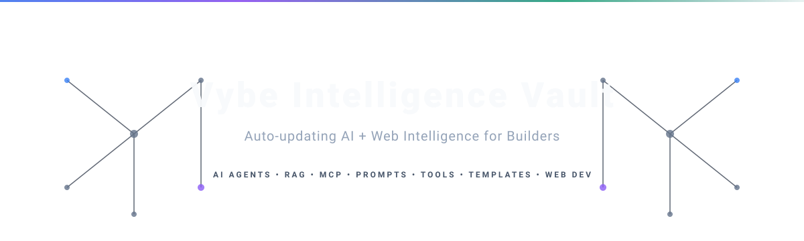

<p align="center">
  
</p>

<div align="center">

# Vybe Intelligence Vault

An auto-updating open-source intelligence vault for AI agents, RAG systems, MCP servers, prompts, tools, templates, and next-generation web development.

[]()
[]()
[]()
[]()
[]()
[]()

</div>

<p align="center">
  <a href="#why-this-vault-is-different">Why Different</a> ·
  <a href="#vault-stats">Stats</a> ·
  <a href="#explore-the-vault">Explore</a> ·
  <a href="#living-skill-files">Living Skills</a> ·
  <a href="#start-building">Start Building</a> ·
  <a href="#how-updates-work">Updates</a>
</p>

---

## Intro

The AI Internet moves fast. New agents, tools, repositories, prompts, research papers, templates, workflows, and frameworks appear every day.

Vybe Intelligence Vault tracks the signal and organizes it into a clean, builder-friendly archive.

Vybe Intelligence Vault is not a static dump. It is a live AI builder intelligence vault that tracks public AI and web-development signals and organizes them into maps, learning paths, build ideas, skill files, indexes, and archive sections.

---

<!-- VAULT_STATS:START -->

## Vault Stats

| Metric | Count |
|---|---:|
| Resources tracked | 2104 |
| Active resources | 2104 |
| Inactive resources | 0 |
| Archive files | 11466 |
| Archive categories | 33 |
| Builder maps | 8 |
| Learning paths | 8 |
| Build ideas | 8 |
| Best-of guides | 6 |
| Last meaningful update | 2026-06-12 20:28 UTC |

### Trend Intelligence Dashboard

#### 🔥 Trending Resources
- **[AI agent bankrupted their operator while trying to scan DN42](ai/community/ai-agent-bankrupted-their-operator-while-trying-to.md)** (+712 points)
- **[A jacket that harvests drinking water from the air](ai/community/a-jacket-that-harvests-drinking-water-from-the-air.md)** (Rank: +2) (+78 points)
- **[Anthropic apologizes for invisible Claude Fable guardrails](ai/community/anthropic-apologizes-for-invisible-claude-fable-gu.md)** (+49 points)
- **[Making a vintage LLM from scratch](ai/community/making-a-vintage-llm-from-scratch.md)** (+35 points)
- **[patchy631/ai-engineering-hub](ai/rag/patchy631-ai-engineering-hub.md)** (Rank: +1)

#### ✨ New Discoveries
- **[Ryanair dark UX patterns summer 2026 refresher](ai/community/ryanair-dark-ux-patterns-summer-2026-refresher.md)** (Score: 174)
- **[The Future of Email](ai/community/the-future-of-email.md)** (Score: 149)
- **[Slightly reducing the sloppiness of AI generated front end](ai/community/slightly-reducing-the-sloppiness-of-ai-generated-f.md)** (Score: 129)
- **[There Is Life Before Main in Rust](ai/community/there-is-life-before-main-in-rust.md)** (Score: 44)
- **[Launch HN: BitBoard (YC P25) – Analytics Workspace for Agents](ai/community/launch-hn-bitboard-yc-p25-analytics-workspace-for.md)** (Score: 21)

#### 💤 Recently Inactive Resources
- None.

The stats shown here are generated from the current vault content. They refresh automatically when the bot finds changes.

<!-- VAULT_STATS:END -->

---

## Why This Vault Is Different

| Typical archive      | Vybe Intelligence Vault                                           |
| -------------------- | ----------------------------------------------------------------- |
| Static list of links | Auto-updated every 3 hours                                        |
| Tool dump            | Builder-focused intelligence system                               |
| Hard to navigate     | Maps, best-of guides, search index, learning paths                |
| Popular repos only   | Also tracks early-stage relevant repos, including zero-star repos |
| Manual updates       | Scheduled automation through GitHub Actions                       |
| Random resources     | Scored, categorized, safety-scanned resources                     |
| Only AI tools        | AI, agents, RAG, MCP, prompts, webdev, automation, startup ideas  |

---

## Explore the Vault

| Section                                 | What it gives you                                    |
| --------------------------------------- | ---------------------------------------------------- |
| [Search Index](search-index.md)         | Searchable map of vault resources                    |
| [Intelligence](intelligence/)           | Latest AI signals, trends, research, repos           |
| [Workspace Archive](workspace-archive/) | Categorized AI and web development archive           |
| [Builder Maps](maps/)                   | Stack maps for agents, RAG, MCP, LLMOps, frontend AI |
| [Build Ideas](build-ideas/)             | Practical project ideas for portfolio and products   |
| [Learning Paths](learning-paths/)       | 7-day learning paths for key skills                  |
| [Examples](examples/)                   | How to use this vault with coding agents             |
| [Stats](stats/)                         | Public vault stats and category counts               |
| [Roadmap](ROADMAP.md)                   | Planned improvements and future direction            |
| [Changelog](CHANGELOG.md)               | Latest meaningful vault updates                      |

---

## What Is Inside

| Area                    | Includes                                        |
| ----------------------- | ----------------------------------------------- |
| AI Agents               | Agent frameworks, orchestration, tool use       |
| RAG Systems             | Retrieval apps, templates, chunking, reranking  |
| MCP Servers             | Servers, tools, examples, security notes        |
| Prompt Libraries        | System prompts, coding prompts, agent prompts   |
| AI Coding Agents        | Codex, Cursor, Windsurf, Claude Code, Cline     |
| LLM App Templates       | FastAPI, Next.js, chat apps, AI SaaS templates  |
| Evals and Observability | RAGAS, promptfoo, Langfuse, tracing, monitoring |
| Frontend AI UI          | Chat UI, dashboards, shadcn, Tailwind layouts   |
| 3D Creative Web         | Three.js, R3F, WebGPU, shaders, Spline          |
| Startup Builder         | MVP ideas, SaaS resources, launch patterns      |

---

## Living Skill Files

The vault does not only save links. It continuously updates skill guides based on recent public GitHub repositories, tools, frameworks, docs, templates, and other useful public resources.

Stars and forks are bonus signals, not gatekeeping filters. A zero-star repository can still be included if it is fresh, relevant, and useful for builders.

| Skill            | Updated signals                                  |
| ---------------- | ------------------------------------------------ |
| AI Agents        | Frameworks, orchestration patterns, agent repos  |
| RAG              | Templates, vector databases, chunking, reranking |
| MCP              | Servers, tools, integrations, examples           |
| LLMOps           | Evals, tracing, monitoring, RAG evaluation       |
| AI Coding Agents | Codex, Cursor, Windsurf, Claude Code, Cline      |
| Frontend AI UI   | Chat UI, dashboards, AI interfaces               |
| 3D Web           | Three.js, React Three Fiber, WebGPU, shaders     |
| Automation       | n8n, Playwright, browser workflows               |

---

## Start Building

| Start Here               | Path                                                                                                           |
| ------------------------ | -------------------------------------------------------------------------------------------------------------- |
| Essential AI Engineering | [workspace-archive/best-of/essential-ai-engineering.md](workspace-archive/best-of/essential-ai-engineering.md) |
| Essential Agent Building | [workspace-archive/best-of/essential-agent-building.md](workspace-archive/best-of/essential-agent-building.md) |
| Essential RAG Stack      | [workspace-archive/best-of/essential-rag-stack.md](workspace-archive/best-of/essential-rag-stack.md)           |
| Essential Frontend AI UI | [workspace-archive/best-of/essential-frontend-ai-ui.md](workspace-archive/best-of/essential-frontend-ai-ui.md) |
| Essential 3D Web Dev     | [workspace-archive/best-of/essential-3d-webdev.md](workspace-archive/best-of/essential-3d-webdev.md)           |
| Essential Automation     | [workspace-archive/best-of/essential-automation.md](workspace-archive/best-of/essential-automation.md)         |
| Newest Resources         | [workspace-archive/_navigation/newest.md](workspace-archive/_navigation/newest.md)                             |
| Skill Index              | [_index/skill-index.md](_index/skill-index.md)                                                                 |

---

## Use With AI Coding Agents

Use this vault with Codex, Cursor, Windsurf, Claude Code, Cline, and Aider.

Example prompt:

```txt
Use this vault to find the best RAG project ideas and create a 7-day build plan.
```

---

## How Updates Work

This vault is refreshed every 3 hours by a private harvester bot running through GitHub Actions.

Each run:
- discovers public resources
- updates archive files
- refreshes living skill files when meaningful changes exist
- rebuilds indexes and stats
- runs a public safety scan
- commits and pushes only valid changes

If no meaningful changes are found, the workflow exits successfully without creating an empty commit.

The laptop does not need to stay on. The vault only uses public sources, preserves source URLs, avoids private or paywalled content, and safety-scanned updates before push.

---

## Repository Structure

```txt
.
├── intelligence/
├── workspace-archive/
├── maps/
├── build-ideas/
├── learning-paths/
├── skills/
├── stats/
├── examples/
├── _index/
├── search-index.md
├── CHANGELOG.md
└── ROADMAP.md
```

---

## Contributing

Found a useful AI repo, prompt library, MCP server, RAG template, dataset, API, or web-development resource?

Open an issue or pull request.

See [CONTRIBUTING.md](CONTRIBUTING.md) for guidelines.

---

## Attribution and Disclaimer

This vault contains curated metadata, summaries, links, and notes from public resources. Original content belongs to respective authors. Source URLs are preserved wherever available.

This repository does not claim ownership of external resources.

---

## License

This project is released under the MIT License where applicable. See [LICENSE](LICENSE).

---

## Support the Vault

If this vault helps you discover useful AI resources, consider starring the repo so more builders can find it.
